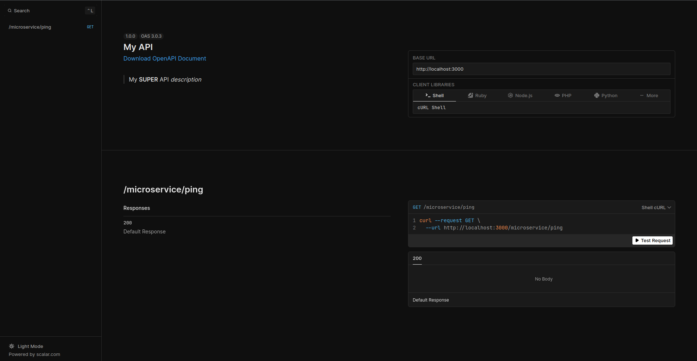
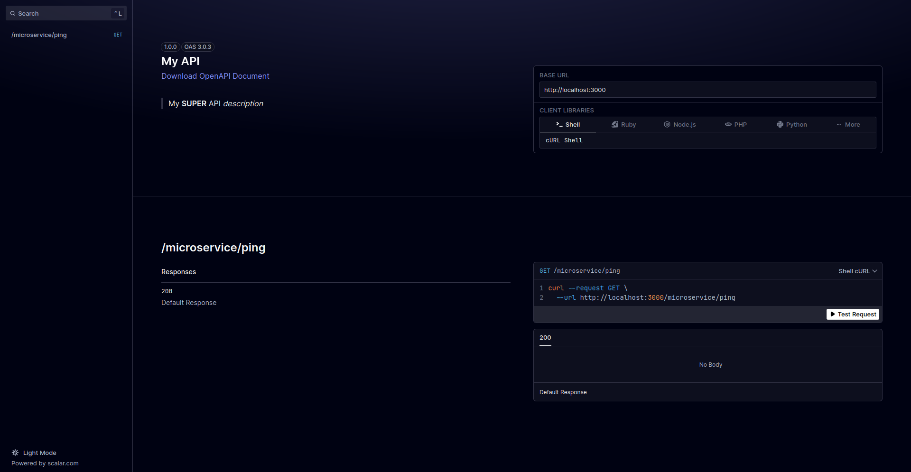

# **🖥️ Serveur HTTP avec Core**

Le serveur HTTP de **Core** repose sur [⚡️ Fastify](https://www.fastify.io/), tout en intégrant une gamme de fonctionnalités sophistiquées qui enrichissent considérablement l'expérience de développement et augmentent la robustesse de l'architecture des API :

## **Quelques Fonctionnalités**

- **🛠️ Gestion avancée des erreurs** : Core offre une gestion exhaustive des erreurs, permettant un traitement efficace et automatisé des exceptions.  
Les erreurs peuvent être générées à l'aide de `CoreError` et `BasaltError`, ce qui permet non seulement une gestion centralisée des exceptions, mais également la possibilité de traduire les messages d'erreurs dans différentes langues 🌍, améliorant ainsi l'internationalisation et l'accessibilité des applications.

- **🔄 Support des hooks personnalisés** : Core permet l'ajout de hooks personnalisés afin de configurer et d'influencer le comportement du serveur à différents moments de son cycle de vie.  
Cette capacité permet aux développeurs d'adapter le serveur à des exigences spécifiques, offrant une flexibilité substantielle pour répondre à des besoins complexes.

- **🔌 Intégration simplifiée des plugins et des routeurs** : L'architecture de Core facilite l'intégration de plugins et de routeurs, grâce à un mécanisme intuitif et modulaire.  
Cela permet aux développeurs de structurer les fonctionnalités de manière cohérente, tout en réduisant la complexité du processus d'intégration et en améliorant la maintenabilité 🛠️.

- **📋 Système de logging flexible** : Core propose un système de journalisation extensible, permettant l'ajout de stratégies de logging personnalisées.  
Cela permet non seulement de surveiller les événements critiques du système, mais également d'adapter les stratégies de journalisation en fonction des besoins spécifiques du projet, favorisant ainsi une meilleure supervision et détection des anomalies 🕵️‍♂️.

- **✅ Validation des données** : Un mécanisme de validation des données est intégré pour assurer la conformité des requêtes entrantes aux schémas définis.  
Cette fonctionnalité garantit l'intégrité des données tout en minimisant les risques d'erreurs dues à des entrées non conformes.

- **⚠️ Gestion des erreurs de validation** : Core intègre une gestion sophistiquée des erreurs de validation, permettant de renvoyer des messages d'erreurs détaillés et personnalisés.  
Cela contribue à améliorer la transparence des erreurs et à offrir une meilleure expérience utilisateur, particulièrement dans les applications nécessitant une validation stricte des entrées.

## **Création Simplifiée des Opérations CRUD**

**Core** permet également une création simplifiée des opérations CRUD, facilitant ainsi la mise en œuvre des fonctionnalités fondamentales d'une application.  
Cette capacité réduit considérablement le temps de développement tout en assurant une structure claire et maintenable pour les interactions de base avec la base de données.

Ces fonctionnalités avancées font de Core un choix privilégié pour le développement d'API RESTful robustes, efficaces et évolutives.

## **Exemples :**

Pour vous aider à démarrer, nous allons explorer les différentes étapes pour configurer et lancer le serveur HTTP de **Core**.

### **Démarrer un serveur HTTP**

Pour démarrer un serveur HTTP, vous devez créer une nouvelle instance de `ServerManager`, qui est responsable de la configuration et de la gestion du cycle de vie du serveur, puis appeler la méthode `start`.

=== "TypeScript"

    ```typescript
    import { ServerManager } from '@andesite-lab/andesite-core';

    // Créer une nouvelle instance de ServerManager
    const serverManager = new ServerManager();

    // Démarrer le serveur HTTP
    await serverManager.start();
    ```

=== "JavaScript"

    ```javascript
    const { ServerManager } = require('@andesite-lab/andesite-core');

    // Créer une nouvelle instance de ServerManager
    const serverManager = new ServerManager();

    // Démarrer le serveur HTTP
    await serverManager.start();
    ```

Le serveur écoutera par défaut sur le port `3000` et l'hôte est `0.0.0.0`

### **Logger avec [Basalt Logger](https://basalt-lab.github.io/basalt-doc/basalt-logger/getting-started.html)**

Vous pouvez ajouter un logger avec différentes stratégies, comme l'affichage des logs dans la console ou leur enregistrement dans un fichier.
*(voir la documentation de [Basalt Logger](https://basalt-lab.github.io/basalt-doc/basalt-logger/getting-started.html) pour plus de détails.).*


!!! note "À savoir"

    Le serveur va loguer dans toute les stratégies de log que vous aurez ajouté dans votre instance de `BasaltLogger`.  
    Je vous conseille uniquement de créer une instance de `BasaltLogger` spécifique pour votre serveur, comme cela vous pourrez mettre uniquement les stratégies de log que vous souhaitez pour votre serveur.

=== "TypeScript"

    ```typescript
    import { ServerManager } from '@andesite-lab/andesite-core';
    import { BasaltLogger, ConsoleLoggerStrategy } from '@basalt-lab/basalt-logger';

    // Créer une instance de BasaltLogger
    const logger = new BasaltLogger();
    // Ajouter une stratégie de log pour la console, avec coloration activée (si vous laissez vide, la coloration sera désactivée)
    logger.addStrategy('console', new ConsoleLoggerStrategy(true));

    // Créer une nouvelle instance de ServerManager avec le logger
    const serverManager = new ServerManager({
        logger,
    });

    // Démarrer le serveur HTTP
    await serverManager.start();
    ```

=== "JavaScript"

    ```javascript
    const { ServerManager } = require('@andesite-lab/andesite-core');
    const { BasaltLogger, ConsoleLoggerStrategy } = require('@basalt-lab/basalt-logger');

    // Créer une instance de BasaltLogger
    const logger = new BasaltLogger();
    // Ajouter une stratégie de log pour la console, avec coloration activée (si vous laissez vide, la coloration sera désactivée)
    logger.addStrategy('console', new ConsoleLoggerStrategy(true));

    // Créer une nouvelle instance de ServerManager avec le logger
    const serverManager = new ServerManager({
        logger,
    });

    // Démarrer le serveur HTTP
    await serverManager.start();
    ```

<!-- termynal -->

```bash
$ node example.js
[2024-10-07 14:23:34] INFO : Server listening on 0.0.0.0:3000
```

### **Base url**

Vous pouvez ajouter une base url à votre serveur. Cela peut être utile si vous avez plusieurs microservices ou si vous avez un reverse proxy.

=== "TypeScript"

    ```typescript
    import { ServerManager } from '@andesite-lab/andesite-core';

    // Créer une nouvelle instance de ServerManager avec une base url
    const serverManager = new ServerManager({
        baseUrl: '/foo/bar',
    });

    // Démarrer le serveur HTTP
    await serverManager.start();
    ```

=== "JavaScript"

    ```javascript
    const { ServerManager } = require('@andesite-lab/andesite-core');

    // Créer une nouvelle instance de ServerManager avec une base url
    const serverManager = new ServerManager({
        baseUrl: '/foo/bar',
    });

    // Démarrer le serveur HTTP
    await serverManager.start();
    ```

Le serveur écoutera par défaut sur le port `3000` et l'hôte est `0.0.0.0` avec une base url de `/foo/bar`

### **Router**

L'utilisation d'un routeur permet d'ajouter des chemins spécifiques à votre serveur HTTP, offrant ainsi une flexibilité accrue pour organiser et gérer les points d'accès de votre application.

!!! note "À savoir"

    Les routeurs doivent étendre la classe `AbstractRouter` et implémenter la méthode `_initRoutes` pour définir les routes.  
    Comme vous pouvez remarquer, vous avez accès à l'instance de `FastifyInstance` pour définir vos routes.

#### **Simple router**

Créons un routeur simple avec une route `GET` `/ping` qui renvoie `pong`.

=== "TypeScript"

    === "index.ts"

        ```typescript
        import { ServerManager } from '@andesite-lab/andesite-core';
        import { BasaltLogger, ConsoleLoggerStrategy } from '@basalt-lab/basalt-logger';

        import { Microservice } from './microservice.router.ts';

        // Initialiser le logger Basalt avec une stratégie de journalisation de la console
        const logger = new BasaltLogger();
        logger.addStrategy('console', new ConsoleLoggerStrategy(true));

        // Créer une nouvelle instance de ServerManager avec le logger
        const serverManager = new ServerManager({
            logger,
        });

        // Ajouter un router
        await serverManager.addRouter(new Microservice('microservice'));

        // Démarrer le serveur HTTP
        await serverManager.start();
        ```

    === "microservice.router.ts"

        ```typescript
        import { AbstractRouter, type FastifyInstance, } from '@andesite-lab/andesite-core';

        // Créer un routeur pour le microservice avec une route ping
        export class Microservice extends AbstractRouter {
            protected override _initRoutes(fastify: FastifyInstance): void {
                fastify.get('/ping', () => 'pong');
            }
        }
        ```

=== "JavaScript"

    === "index.js"

        ```javascript
        const { ServerManager } = require('@andesite-lab/andesite-core');
        const { BasaltLogger, ConsoleLoggerStrategy } = require('@basalt-lab/basalt-logger');

        // Initialiser le logger Basalt avec une stratégie de journalisation de la console
        const logger = new BasaltLogger();
        logger.addStrategy('console', new ConsoleLoggerStrategy(true));

        // Créer une nouvelle instance de ServerManager avec le logger
        const serverManager = new ServerManager({
            logger,
        });

        // Ajouter un router
        await serverManager.addRouter(new Microservice('microservice'));

        // Démarrer le serveur HTTP
        await serverManager.start();
        ```

    === "microservice.router.js"

        ```javascript
        const { AbstractRouter } = require('@andesite-lab/andesite-core');

        // Créer un routeur pour le microservice avec une route ping
        class Microservice extends AbstractRouter {
            _initRoutes(fastify) {
                fastify.get('/ping', () => 'pong');
            }
        }

        module.exports = Microservice;
        ```

<!-- termynal -->

```bash
$ node example.js
[2024-12-12 12:12:12] INFO : Server listening on 0.0.0.0:3000

// Le serveur logue la requête
[2024-12-12 12:12:13] INFO : {"requestId":"req-1","hostname":"localhost","ip":"127.0.0.1","ips":["127.0.0.1"],"method":"GET","url":"/microservice/ping","statusCode":200,"createdAt":"2024-12-12T12:12:13.466Z"}

// Vous pouvez maintenant accéder à votre route en utilisant l'URL http://localhost:3000/microservice/ping
$ curl http://localhost:3000/microservice/ping
pong
```

#### **Multiple routers**

Vous pouvez ajouter plusieurs routeurs à votre serveur HTTP.

=== "TypeScript"

    === "index.ts"

        ```typescript
        import { ServerManager } from '@andesite-lab/andesite-core';
        import { BasaltLogger, ConsoleLoggerStrategy } from '@basalt-lab/basalt-logger';

        import { Example1 } from './example1.router.ts';
        import { Example2 } from './example2.router.ts';

        // Initialiser le logger Basalt avec une stratégie de journalisation de la console
        const logger = new BasaltLogger();
        logger.addStrategy('console', new ConsoleLoggerStrategy(true));

        // Créer une nouvelle instance de ServerManager avec le logger
        const serverManager = new ServerManager({
            logger,
        });

        // Ajouter les routeurs
        await serverManager.addRouters([
            new Example1('example1'),
            new Example2('example2'),
        ]);

        // Démarrer le serveur HTTP
        await serverManager.start();
        ```

    === "example1.router.ts"

        ```typescript
        import { AbstractRouter, type FastifyInstance, } from '@andesite-lab/andesite-core';

        // Créer un routeur pour l'example 1 avec une route ping
        export class Example1 extends AbstractRouter {
            protected override _initRoutes(fastify: FastifyInstance): void {
                fastify.get('/ping', () => 'pong');
            }
        }
        ```

    === "example2.router.ts"

        ```typescript
        import { AbstractRouter, type FastifyInstance, } from '@andesite-lab/andesite-core';

        // Créer un routeur pour l'example 2 avec une route ping
        export class Example2 extends AbstractRouter {
            protected override _initRoutes(fastify: FastifyInstance): void {
                fastify.get('/ping', () => 'pong');
            }
        }
        ```
=== "JavaScript"

    === "index.js"

        ```javascript
        const { ServerManager } = require('@andesite-lab/andesite-core');
        const { BasaltLogger, ConsoleLoggerStrategy } = require('@basalt-lab/basalt-logger');

        // Initialiser le logger Basalt avec une stratégie de journalisation de la console
        const logger = new BasaltLogger();
        logger.addStrategy('console', new ConsoleLoggerStrategy(true));

        // Créer une nouvelle instance de ServerManager avec le logger
        const serverManager = new ServerManager({
            logger,
        });

        // Ajouter les routeurs
        await serverManager.addRouters([
            new Example1('example1'),
            new Example2('example2'),
        ]);

        // Démarrer le serveur HTTP
        await serverManager.start();
        ```

    === "example1.router.js"

        ```javascript
        const { AbstractRouter } = require('@andesite-lab/andesite-core');

        // Créer un routeur pour l'exemple 1 avec une route ping
        class Example1 extends AbstractRouter {
            _initRoutes(fastify) {
                fastify.get('/ping', () => 'pong');
            }
        }

        module.exports = Example1;
        ```

    === "example2.router.js"

        ```javascript
        const { AbstractRouter } = require('@andesite-lab/andesite-core');

        // Créer un routeur pour l'exemple 2 avec une route ping
        class Example2 extends AbstractRouter {
            _initRoutes(fastify) {
                fastify.get('/ping', () => 'pong');
            }
        }

        module.exports = Example2;
        ```
<!-- termynal -->

```bash
$ node example.js
[2024-12-12 12:12:12] INFO : Server listening on

// Le serveur log les requêtes
[2024-12-12 12:12:13] INFO : {"requestId":"req-1","hostname":"localhost","ip":"127.0.0.1","ips":["127.0.0.1"],"method":"GET","url":"/example1/ping","statusCode":200,"createdAt":"2024-12-12T12:12:13.466Z"}
[2024-12-12 12:12:14] INFO : {"requestId":"req-1","hostname":"localhost","ip":"127.0.0.1","ips":["127.0.0.1"],"method":"GET","url":"/example2/ping","statusCode":200,"createdAt":"2024-12-12T12:12:14.466Z"}

// Vous pouvez maintenant accéder à vos routes en utilisant les URL http://localhost:3000/example1/ping et http://localhost:3000/example2/ping
$ curl http://localhost:3000/example1/ping  
pong
$ curl http://localhost:3000/example2/ping
pong
```

#### **Schema de validation**

Concernant les schemas de validation, vous pouvez retrouver la documentation complète de [Fastify Schema](https://fastify.dev/docs/latest/Reference/Validation-and-Serialization/) et [Fluent Schema](https://fastify.dev/docs/latest/Guides/Fluent-Schema/).

Fastify utilise AJV pour la validation des données, vous pouvez donc utiliser les schemas de validation JSON.

Nous allons voir par la suite differents moyen de réaliser des schemas de validation.


##### **Schema de validation simple**


### **Plugins**

Vous pouvez ajouter une base url à votre serveur. Cela peut être utile si vous avez plusieurs microservices.

#### Plugin prêt à l'emploi dans Core

Le Core fournit quelques plugins prêts à l'emploi, mais vous pouvez en ajouter d'autres aisément. (voir la section suivante et Fastify Plugins)

- **CorsPlugin**: Ajoute le support de CORS à votre serveur.

Vous pouvez ajouter des options à `CorsPlugin` pour personnaliser la configuration de CORS.
Exemple:
```typescript
{
    origins: '*',
    methods: ['GET', 'POST', 'PUT', 'DELETE'],
    credentials: true 
}
```
- **FormBodyPlugin**: Ajoute le support de `application/x-www-form-urlencoded` et `multipart/form-data` à votre serveur.

Il est possible de personnaliser la configuration de `FormBodyPlugin` en ajoutant `bodyLimit` pour limiter la taille du corps de la requête.
Exemple:
```typescript
{
    bodyLimit: 1024 * 1024 * 10 // 10MB
}
```

- **HelmetPlugin**: Ajoute des en-têtes de sécurité à votre serveur.

=== "TypeScript"

    ```typescript
    import {
        CorsPlugin,
        FormBodyPlugin,
        HelmetPlugin,
        ServerManager
    } from '@andesite-lab/andesite-core';

    const serverManager = new ServerManager();

    await serverManager.addPlugins([
        new CorsPlugin(),
        new HelmetPlugin(),
        new FormBodyPlugin()
    ]);

    await serverManager.start();
    ```

=== "JavaScript"

    ```javascript
    const {
        CorsPlugin,
        FormBodyPlugin,
        HelmetPlugin,
        ServerManager
    } = require('@andesite-lab/andesite-core');

    const serverManager = new ServerManager();

    await serverManager.addPlugins([
        new CorsPlugin(),
        new HelmetPlugin(),
        new FormBodyPlugin()
    ]);
    ```

#### **Swagger et Scalar UI**

Vous pouvez ajouter un plugin **Swagger** pour documenter votre API et un plugin **Scalar UI** pour avoir une interface utilisateur pour tester vos routes.
!!! warning
    
    **Scalar doit être ajouté après le Swagger et après les routes.**

La configuration de Swagger est basée sur [OpenAPI](https://swagger.io/specification/).

=== "TypeScript"

    === "index.ts"

        ```typescript
        import {
            ServerManager,
            SwaggerPlugin,
            SwaggerScalarUiPlugin,
        } from '@andesite-lab/andesite-core';
        import { BasaltLogger, ConsoleLoggerStrategy } from '@basalt-lab/basalt-logger';

        import { Microservice } from './microservice.router.ts';

        const logger = new BasaltLogger();
        logger.addStrategy('console', new ConsoleLoggerStrategy(true));
        const serverManager = new ServerManager({
            logger,
        });

        await serverManager.addPlugin(
            new SwaggerPlugin({
                openapi: {
                    info: {
                        title: 'My API',
                        description: '> My **SUPER** API *description*', // Vous pouvez utilisez du Markdown
                        version: '1.0.0',
                    },
                }
            })
        );

        // Ajouter un router
        await serverManager.addRouter(new Microservice('microservice'));

        await serverManager.addPlugin(new SwaggerScalarUiPlugin());

        await serverManager.start();
        ```

    === "microservice.router.ts"

        ```typescript
        import { AbstractRouter, type FastifyInstance, } from '@andesite-lab/andesite-core';

        export class Microservice extends AbstractRouter {
            protected override _initRoutes(fastify: FastifyInstance): void {
                fastify.get('/ping', () => 'pong');
            }
        }
        ```

=== "JavaScript"

    === "index.js"

        ```javascript
        const {
            ServerManager,
            SwaggerPlugin,
            SwaggerScalarUiPlugin,
        } = require('@andesite-lab/andesite-core');
        const { BasaltLogger, ConsoleLoggerStrategy } = require('@basalt-lab/basalt-logger');

        const logger = new BasaltLogger();
        logger.addStrategy('console', new ConsoleLoggerStrategy(true));
        const serverManager = new ServerManager({
            logger,
        });

        await serverManager.addPlugin(
            new SwaggerPlugin({
                openapi: {
                    info: {
                        title: 'My API',
                        description: '> My **SUPER** API *description*', // Vous pouvez utilisez du Markdown
                        version: '1.0.0',
                    },
                }
            })
        );

        // Ajouter un router
        await serverManager.addRouter(new Microservice('microservice'));

        await serverManager.addPlugin(new SwaggerScalarUiPlugin());

        await serverManager.start();
        ```

    === "microservice.router.js"

        ```javascript
        const { AbstractRouter } = require('@andesite-lab/andesite-core');

        class Microservice extends AbstractRouter {
            _initRoutes(fastify) {
                fastify.get('/ping', () => 'pong');
            }
        }

        module.exports = Microservice;
        ```

Vous pouvez maintenant accéder à Scalar en utilisant l'URL [http://localhost:3000/swagger](http://localhost:3000/swagger).

{loading=lazy}

Vous pouvez modifier par exemple le theme de Scalar en ajoutant un paramètre `theme` dans le constructeur de `SwaggerScalarUiPlugin`.
```typescript
await serverManager.addPlugin(new SwaggerScalarUiPlugin({
    theme: 'kepler',
}));
```

{loading=lazy}

Vous avez également d'autre options comme le `path` pour changer le chemin de l'interface utilisateur ou même `customCss` pour ajouter votre propre CSS.

#### Plugin personnalisé

Si vous souhaitez créer un plugin personnalisé ou même en ajouter un existant, vous devez créer une classe qui implémente l'interface `Plugin`.

=== "TypeScript"

    === "index.ts"

        ```typescript
        import {
            CorsPlugin,
            FormBodyPlugin,
            HelmetPlugin,
            ServerManager
        } from '@andesite-lab/andesite-core';

        import { MyPlugin } from './my-plugin.ts';

        const serverManager = new ServerManager();

        await serverManager.addPlugins([
            new CorsPlugin(),
            new HelmetPlugin(),
            new FormBodyPlugin(),
            new MyPlugin()
        ]);

        await serverManager.start();
        ```

    === "my-plugin.ts"

        ```typescript
        import {
            type Plugin,
            type FastifyInstance,
        } from '@andesite-lab/andesite-core';

        export class MyPlugin implements Plugin {
            public async configure(app: FastifyInstance, baseUrl: string): Promise<void> {
                await app.register((instance, _, done) => {
                    instance.get(baseUrl, () => ({ hello: 'world' }));
                    done();
                });
            }
        }
        ```

=== "JavaScript"

    === "index.js"

        ```javascript
        const {
            CorsPlugin,
            FormBodyPlugin,
            HelmetPlugin,
            ServerManager
        } = require('@andesite-lab/andesite-core');

        const MyPlugin = require('./my-plugin.js');

        const serverManager = new ServerManager();

        await serverManager.addPlugins([
            new CorsPlugin(),
            new HelmetPlugin(),
            new FormBodyPlugin(),
            new MyPlugin()
        ]);

        await serverManager.start();
        ```

    === "my-plugin.js"

        ```javascript
        const { Plugin } = require('@andesite-lab/andesite-core');

        class MyPlugin extends Plugin {
            async configure(app, baseUrl) {
                await app.register((instance, _, done) => {
                    instance.get(baseUrl, () => ({ hello: 'world' }));
                    done();
                });
            }
        }

        module.exports = MyPlugin;
        ```

<!-- termynal -->

```bash
$ node example.js

$ curl http://localhost:3000
{"hello":"world"}
```